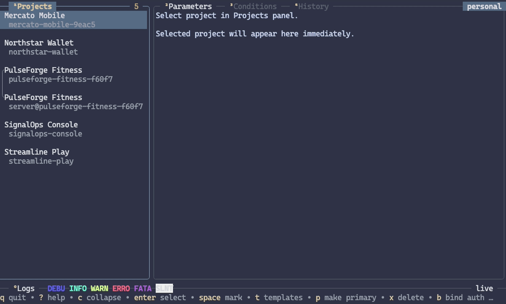

# fbrcm

`fbrcm` is a terminal manager for Firebase Remote Config. Use its interactive
TUI to explore and edit projects, or use the CLI for scripts, repeatable
operations, and machine-readable output.



> [!CAUTION]
> This project is almost completely vibe-coded.

It is designed for work that spans more than one Firebase project:

- inspect parameters, groups, conditions, and version history;
- compare and promote configuration between projects or template types;
- stage related changes as local drafts before publishing;
- import, export, validate, roll back, and restore Remote Config templates;
- manage client and server templates from the same workspace.

## Installation

### macOS and Linux

Install the latest release:

```sh
curl -sSfL https://raw.githubusercontent.com/yumauri/fbrcm/main/install.sh | sh
```

The installer places `fbrcm` in `/usr/local/bin` by default. To use another
directory:

```sh
curl -sSfL https://raw.githubusercontent.com/yumauri/fbrcm/main/install.sh |
  INSTALL_DIR="$HOME/.local/bin" sh
```

With [Homebrew](https://brew.sh):

```sh
brew tap yumauri/tap
brew install --cask fbrcm
```

### Windows

With [Scoop](https://scoop.sh):

```powershell
scoop bucket add yumauri https://github.com/yumauri/scoop-bucket
scoop install fbrcm
```

### Other options

Download an archive from
[GitHub Releases](https://github.com/yumauri/fbrcm/releases), or install from
source with Go 1.26.5 or newer:

```sh
go install github.com/yumauri/fbrcm@latest
```

## First run

Start the TUI:

```sh
fbrcm
```

On a new profile, fbrcm opens guided setup. It supports:

- an OAuth Desktop app client;
- a service-account JSON key;
- existing gcloud Application Default Credentials.

The identity needs access to the projects you want to manage. Project discovery
uses the Cloud Resource Manager API; template reads, validation, publication,
defaults, and history use the Firebase Remote Config API.

After setup, run the built-in diagnostic whenever you need to check credentials,
connectivity, API access, permissions, or local storage:

```sh
fbrcm doctor
```

See [TUI setup and workflows](docs/TUI.md#setup-and-authentication) for the
guided path, or [CLI authentication](docs/CLI.md#fbrcm-auth-list) for
non-interactive setup.

## A quick tour

Run `fbrcm` with no arguments for the TUI. Press `?` anywhere to open the
searchable action palette; it shows the shortcuts that are relevant to the
current panel.

Any argument selects CLI mode:

```sh
# Refresh and list accessible projects.
fbrcm projects list --update

# Inspect one parameter across matching projects.
fbrcm get feature_enabled --project '^prod'

# Preview a change without writing it.
fbrcm update feature_enabled --project '=my-app' --boolean true --dry-run

# Stage the same change in a local draft.
fbrcm update feature_enabled --project '=my-app' --boolean true --draft

# Review and publish the draft.
fbrcm draft diff my-app --against current
fbrcm draft publish my-app
```

Project and parameter filters support fuzzy, prefix, contains, and exact modes.
Expression filters can also inspect typed values and complete Remote Config
context:

```sh
fbrcm get --expr 'value == true'
fbrcm projects list --expr '"feature_enabled" in keys(parameters)'
```

## Drafts and safe writes

Remote Config publication replaces a complete template, so fbrcm treats review
as part of the write workflow:

- write commands show a diff and normally ask for confirmation;
- `--dry-run` previews without changing Firebase or local drafts;
- `--draft` stages supported mutations in the active profile;
- draft publication rebases local intent onto current Firebase state and stops
  on conflicts;
- multi-project publication is non-atomic: each project succeeds or fails
  independently, and fbrcm reports every result.

Client and server templates have independent drafts, caches, and histories.
Use an explicit target such as `client@my-project` or
`server@my-project` when the configured default is not the one you want.

## Configuration

The TUI key map and active-profile preference live in the global `config.toml`.
Inspect the effective configuration and its path with:

```sh
fbrcm config show
fbrcm config path
```

For example:

```sh
fbrcm config set powerline_glyphs false
fbrcm config set keys.projects.refresh u ctrl+r
fbrcm config validate
```

Profiles keep authentication, project selection, drafts, and caches separate.
Use `Ctrl+P` in the TUI or `fbrcm profile --help` in the CLI.

## Documentation

| Guide | Use it for |
| --- | --- |
| [TUI guide](docs/TUI.md) | Setup, panels, shortcuts, editing, drafts, history, promotion, and key configuration |
| [CLI reference](docs/CLI.md) | Complete command tree, flags, output contracts, template targets, and write behavior |
| [Expression filters](docs/EXPR.md) | Expression contexts, typed values, helper functions, and `jq` queries |
| [Architecture](docs/architecture.md) | Package boundaries and maintainer invariants |
| [Root group keys](docs/root-group-key.md) | Internal root-parameter representations |

Every CLI command also has focused help:

```sh
fbrcm --help
fbrcm projects promote --help
```

## Build from source

The module currently requires Go 1.26.5 or newer:

```sh
git clone https://github.com/yumauri/fbrcm.git
cd fbrcm
go build -o fbrcm .
go test ./...
```

## Security notes

Treat OAuth client files, OAuth tokens, and service-account keys as secrets.
Use `fbrcm auth path <auth-id>` to locate identity files.

Do not store secrets in Remote Config values. Applications can receive and
inspect the parameters available to them.

Cached historical templates may outlive Firebase's retained history. Clearing
the fbrcm cache can therefore remove the only remaining local copy of an old
template. Drafts are separate and are deleted only through explicit draft or
project cleanup operations.

## License

[MIT](LICENSE)
